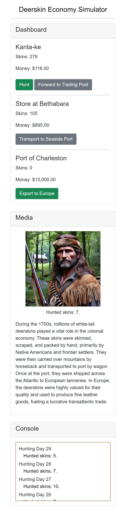

# DeerskinSimulation

### Overview

**Objective**: Blazor WebAssembly simulation of the deerskin economy in the 1700s, focusing on the roles of hunters, traders, and exporters.

### Background

Over the course of the 1700s, millions of white-tail deerskins made the same journey, skinned, scraped and packed by human hands, carried over mountain passes by horseback, ferried to port by wagon, floated across the Atlantic ocean by ship, and then sold by the candle to tanneries in Europe.
